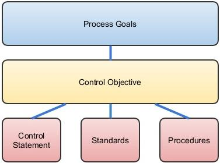

# Security

## Table of Contents

- [Open Web Application Security Project (OWASP)](#owasp)

---

# OWASP

> OWASP is a worldwide not-for-profit charitable organization focused on improving the security of software.

**Home Page:** https://www.owasp.org/index.php/Main_Page
**Youtube:** https://www.youtube.com/OWASPGLOBAL/

- [Activities](#Activites)
- [Attacks](#Attacks)
- [Cheat Sheets](#Cheat-Sheets): e.g. [Cross-Site Request Forgery (CSRF) Prevention Cheat Sheet](#Cheat-Sheets)
- [Checklists](#Checklists): e.g. [Mobile Apps Checklist](#Checklists)
- [Controls](#Controls)
- [Guidelines](#Guidelines): e.g. [Secure Coding Practices Quick Reference](#Guidelines)
- [Projects](#Projects): e.g. [OWASP Top Ten](#Top-Ten-Project)
- [Principles](#Principles)
- [Standards](#Standards): e.g. [Application Security Verification Standard](#Standards)
- [Teaching Environments](#Teaching-Environments): e.g. [Webgoat](#Goats)
- [Threats](#Threats)
- [Vulnerabilities](#Vulnerabilities)

---


# Activities

> Application security activities are key practices that are performed during the software development lifecycle in order to reduce risk or increase assurance in an application. E.g. Log review and management

https://www.owasp.org/index.php/Category:Activity

[Contents](#OWASP)


# Attacks

> Attacks are the techniques that attackers use to exploit the vulnerabilities in applications. E.g. SQL injection

https://www.owasp.org/index.php/Category:Attack

[Contents](#OWASP)


# Cheat Sheets

- https://www.owasp.org/index.php/OWASP_Cheat_Sheet_Series
- https://github.com/OWASP/CheatSheetSeries
- https://github.com/OWASP/CheatSheetSeries/blob/master/Index.md
- **https://github.com/OWASP/CheatSheetSeries/tree/master/cheatsheets**

[Contents](#OWASP)


# Checklists

- https://www.owasp.org/index.php/OWASP_Secure_Coding_Practices_Checklist

1)	[Input Validation](https://www.owasp.org/index.php/OWASP_Secure_Coding_Practices_Checklist#Input_Validation)
2)	[Output Encoding](https://www.owasp.org/index.php/OWASP_Secure_Coding_Practices_Checklist#Output_Encoding)
3)	[Authentication and Password Management](https://www.owasp.org/index.php/OWASP_Secure_Coding_Practices_Checklist#Authentication_and_Password_Management)
4)	[Session Management](https://www.owasp.org/index.php/OWASP_Secure_Coding_Practices_Checklist#Session_Management)
5)	[Access Control](https://www.owasp.org/index.php/OWASP_Secure_Coding_Practices_Checklist#Access_Control)
6)	[Cryptographic Practices](https://www.owasp.org/index.php/OWASP_Secure_Coding_Practices_Checklist#Cryptographic_Practices)
7)	[Error Handling and Logging](https://www.owasp.org/index.php/OWASP_Secure_Coding_Practices_Checklist#Error_Handling_and_Logging)
8)	[Communication Security](https://www.owasp.org/index.php/OWASP_Secure_Coding_Practices_Checklist#Communication_Security)
9)	[System Configuration](https://www.owasp.org/index.php/OWASP_Secure_Coding_Practices_Checklist#System_Configuration)
10)	[Database Security](https://www.owasp.org/index.php/OWASP_Secure_Coding_Practices_Checklist#Database_Security)
11)	[File Management](https://www.owasp.org/index.php/OWASP_Secure_Coding_Practices_Checklist#File_Management)
12)	[Memory Management](https://www.owasp.org/index.php/OWASP_Secure_Coding_Practices_Checklist#Memory_Management)
13)	[General Coding Practices](https://www.owasp.org/index.php/OWASP_Secure_Coding_Practices_Checklist#General_Coding_Practices)

[Contents](#OWASP)


# Controls

> [The Information Systems Audit and Control Association (ISACA)](https://www.isaca.org/pages/default.aspx) defines control as the means of managing risk, including policies, procedures, guidelines, practices or organizational structures, which can be of an administrative, technical, management, or legal nature.

**https://www.owasp.org/index.php/Category:Control**

Breakdown could include **administrative**, **technical** and **physical** controls. Alternatively; **preventive**, **detective** and **corrective**.



**Examples of Application Software Security controls (The Council on CyberSecurity Critical Security Controls):**
```
- Patching
- Implement a Web Application Firewall (WAF)
- Error checking all input
- Use an automated scanner to look for security weaknesses
- Output sanitization of error messages
- Segregation development and production environments
- Secure code analysis, manual and automated
- Verify vendor security processes
- Database configuration hardening
- Train developers on writing secure code
- Remove development artifacts from production code
```

*Of these 11, it is interesting to note that two relate to **infrastructure architecture**, four are **operational**, two are part of **testing processes**, and only three are things that are done as part of **coding**.*

[Contents](#OWASP)


# Guidelines

**[OWASP Secure Coding Practices - Quick Reference Guide](https://www.owasp.org/index.php/OWASP_Secure_Coding_Practices_-_Quick_Reference_Guide)**

[Contents](#OWASP)


# Projects

### Top Ten Project

> OWASP Top 10 Most Critical Web Application Security Risks

- **https://www.owasp.org/index.php/Category:OWASP_Top_Ten_Project**
- **https://github.com/OWASP/Top10**
- **https://github.com/OWASP/OWASP-Top-10**

**Purpose:** The OWASP Top Ten provides a powerful awareness document for web application security. The OWASP Top Ten represents a broad consensus about what the most critical web application security flaws are.

**2017 (latest) - https://www.owasp.org/images/7/72/OWASP_Top_10-2017_%28en%29.pdf.pdf**

**Top 10 2017:**
```
1) Injection
2) Broken Authentication
3) Sensitive Data Exposure
4) XML External Entities (XXE)
5) Broken Access Control
6) Security Misconfiguration
7) Cross-Site Scripting (XSS)
8) Insecure Deserialisation
9) Using Components With Known Vulnerabilities
10) Insufficient Logging And Monitoring
```

[Contents](#OWASP)


# Principles

> Application security principles are collections of desirable application properties, behaviors, designs and implementation practices that attempt to reduce the likelihood of threat realization and impact should that threat be realized.

https://www.owasp.org/index.php/Category:Principle

[Contents](#OWASP)


# Standards

[Application Security Verification Standard](https://www.owasp.org/index.php/Category:OWASP_Application_Security_Verification_Standard_Project)

> The [OWASP Application Security Verification Standard (ASVS)](https://www.owasp.org/index.php/Category:OWASP_Application_Security_Verification_Standard_Project) Project provides a basis for testing web application technical security controls and also provides developers with a list of requirements for secure development.

[Contents](#OWASP)


# Teaching Environments

### Goats

> Deliberately insecure web applications maintained by OWASP designed to teach web application security lessons.

**Webgoat:** https://github.com/WebGoat/WebGoat

**Railsgoat:** https://github.com/OWASP/railsgoat

**.Netgoat:** https://github.com/OWASP/WebGoat.NET

[Contents](#OWASP)


# Threats

> A threat that plague a product. While known threats are identified based on signatures, files copied onto the hard drive upon installation, registry keys, protocol analysis and others; we identify unknown threats by studying the product's behavior over a period of time.

**https://www.owasp.org/index.php/Category:Threat**

**Examples of threats:**
```
- Reverse Trojan (Server-to-Client)
- Time bomb
- Bots
- Logic bomb
- Key loggers
- Sniffers
- Backdoors
- Rootkits
- Viruse
- Worm
- Spyware
- Trojan Horse
```


[Contents](#OWASP)


# Vulnerabilities

> A vulnerability is a hole or a weakness in the application, which can be a design flaw or an implementation bug, that allows an attacker to cause harm to the stakeholders of an application.

**https://www.owasp.org/index.php/Category:Vulnerability**

The term "vulnerability" is often used very loosely. However, here we need to distinguish [threats](#Threats), [attacks](#Attacks), and countermeasures.

**Examples of vulnerabilities:**
```
- Lack of input validation on user input
- Lack of sufficient logging mechanism
- Fail-open error handling
- Not closing the database connection properly
```

[Contents](#OWASP)

---

**Resources:**

- OWASP: https://www.owasp.org/index.php/Main_Page
- Attacks: https://www.owasp.org/index.php/Category:Activity
- Cheat Sheets: https://www.owasp.org/index.php/OWASP_Cheat_Sheet_Series
- Cheat Sheets: https://github.com/OWASP/CheatSheetSeries
- Cheat Sheets: https://github.com/OWASP/CheatSheetSeries/blob/master/Index.md
- Checklists: https://www.owasp.org/index.php/OWASP_Secure_Coding_Practices_Checklist
- Controls: https://www.owasp.org/index.php/Category:Control
- Guidelines (OWASP_Secure_Coding_Practices): https://www.owasp.org/index.php/OWASP_Secure_Coding_Practices_-_Quick_Reference_Guide
- Projects (Top Ten): https://www.owasp.org/index.php/Category:OWASP_Top_Ten_Project
- Projects (Top Ten): https://github.com/OWASP/Top10
- Projects (Top Ten): https://github.com/OWASP/OWASP-Top-10
- Principles: https://www.owasp.org/index.php/Category:Principle
- Standards: https://www.owasp.org/index.php/Category:OWASP_Application_Security_Verification_Standard_Project
- Teaching Environments (Webgoat): https://github.com/WebGoat/WebGoat
- Teaching Environments (Railsgoat): https://github.com/OWASP/railsgoat
- Teaching Environments (.Netgoat): https://github.com/OWASP/WebGoat.NET
- Threats: https://www.owasp.org/index.php/Category:Threat
- Vulnerabilities: https://www.owasp.org/index.php/Category:Vulnerability

[Contents](#OWASP)